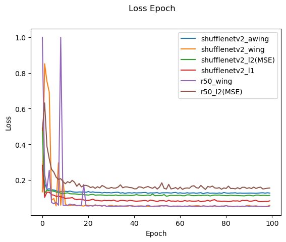

# Simple Landmark loss 
Implementation of Wing Loss paper - [Wing Loss for Robust Facial Landmark Localisation with Convolutional Neural Networks](https://arxiv.org/abs/1711.06753)
Implementation of Adaptive Wing Loss paper - [Adaptive Wing Loss for Robust Face Alignment via Heatmap Regression](https://arxiv.org/abs/1904.07399)

## Installation
Conda environment (recommended)
``` shell
python3 -m pip install -r requirement.txt
```
## Training

Data preparation
you can download simple data on kaggle via internet at: https://www.kaggle.com/datasets/drgilermo/face-images-with-marked-landmark-points

extrace zip file and change direction

run each cell in main.ipynb or you can find my work at https://www.kaggle.com/code/bigvikker/wingloss-landmark-points-dectection/notebook

## Usage

In validate step at main.ipynb

## Model extraction
ResNet18: https://github.com/pytorch/vision/blob/main/torchvision/models/resnet.py
ShuffleNetV2x0.5: https://github.com/pytorch/vision/blob/main/torchvision/models/shufflenetv2.py

## Result 
<div align="center">
    <a href="./">
        
    </a>
</div>

## How is work
1- load .npz file with numpy library.
2- remove all index got not a number labels.
3- create dataloader with image preprocess (-127 and /255) and labels nor
4- split data
5- traing 2 model R18, ShuffleNetV2x0.5 with 4 dependent loss (L1, L2, Wing Loss, Adaptive Wing Loss)
6- show best result on validation data set

## Relative work
https://github.com/protossw512/AdaptiveWingLoss

## License

